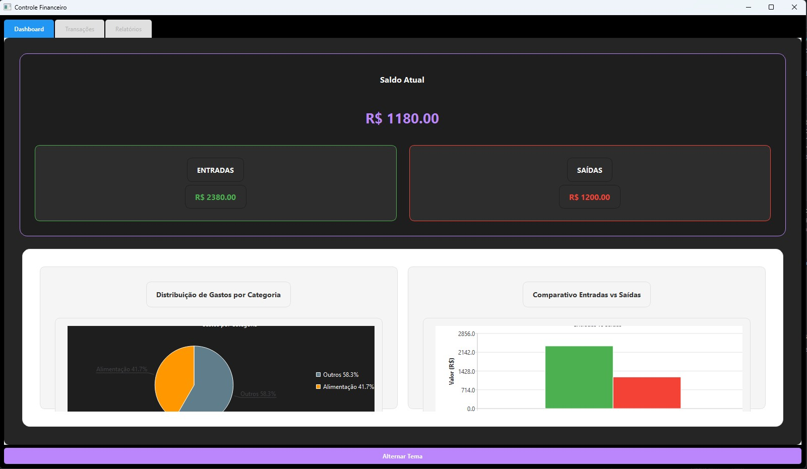
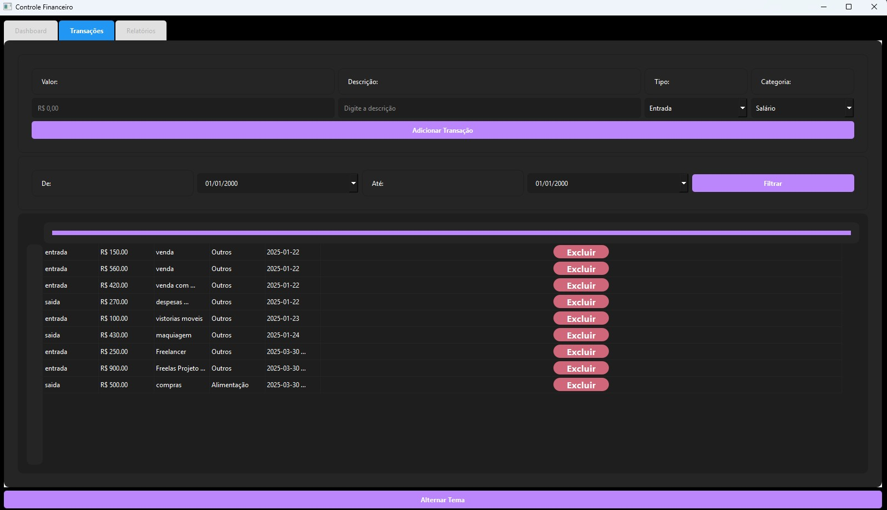
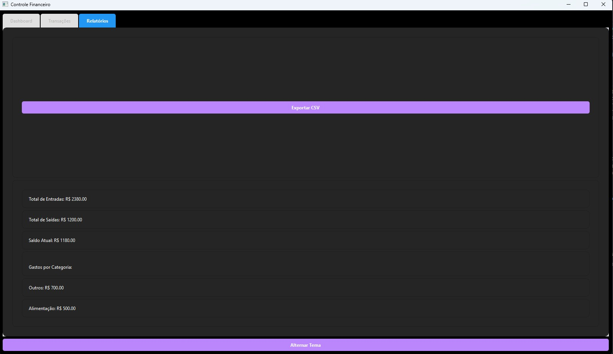

# Controle de Caixa

Um sistema moderno e intuitivo para gerenciamento financeiro pessoal, desenvolvido em Python com interface gráfica PyQt6.

## 📋 Sobre o Projeto

O Controle de Caixa é uma aplicação desktop que permite o gerenciamento eficiente de suas finanças pessoais, oferecendo:

- Registro de entradas e saídas
- Categorização de transações
- Dashboard interativo com gráficos
- Relatórios detalhados
- Backup automático dos dados
- Interface moderna e responsiva
- Suporte a temas claro e escuro

## 🚀 Tecnologias Utilizadas

- Python 3.8+
- PyQt6
- QtCharts
- JSON para armazenamento de dados

## 📦 Estrutura do Projeto

```
Controle de Caixa/
├── src/
│   ├── models/
│   │   ├── __init__.py
│   │   └── controle_caixa.py
│   ├── views/
│   │   ├── __init__.py
│   │   ├── dashboard.py
│   │   ├── main_window.py
│   │   ├── relatorios.py
│   │   └── transacoes.py
│   ├── utils/
│   │   ├── __init__.py
│   │   ├── constantes.py
│   │   └── temas.py
│   ├── controllers/
│   │   └── __init__.py
│   ├── resources/
│   │   └── __init__.py
│   ├── __init__.py
│   └── main.py
├── data/
│   ├── transacoes.json
│   └── backups/
│       └── .gitkeep
├── screenshots/
│   ├── dashboard.jpg
│   ├── relatorios.jpg
│   └── transacoes.jpg
├── requirements.txt
├── .gitignore
├── LICENSE
└── README.md
```

## 🛠️ Instalação

1. Clone o repositório:
```bash
git clone https://github.com/Megadurck/controle-financeiro.git
cd controle-financeiro
```

2. Instale as dependências:
```bash
pip install -r requirements.txt
```

3. Execute o programa:
```bash
python -m src.main
```

## 📸 Screenshots

### Dashboard

*Dashboard com visão geral das finanças e gráficos interativos*

### Registro de Transações

*Interface para registro e gerenciamento de transações*

### Relatórios

*Relatórios detalhados com filtros e exportação*

## ✨ Funcionalidades

### Dashboard
- Saldo atual em destaque
- Cards de entradas e saídas
- Gráfico de pizza: distribuição de gastos por categoria
- Gráfico de barras: comparativo entradas vs saídas

### Transações
- Registro de entradas e saídas
- Categorização personalizada
- Descrição detalhada
- Data e hora automáticas
- Edição e exclusão de registros

### Relatórios
- Filtros por período
- Filtros por categoria
- Filtros por tipo de transação
- Exportação de dados
- Visualização em tabela

### Recursos Adicionais
- Backup automático dos dados
- Temas claro e escuro
- Interface responsiva
- Validação de dados
- Confirmação de exclusão

## 🔒 Segurança

- Backup automático a cada 5 transações
- Validação de dados antes do salvamento
- Confirmação para exclusão de registros
- Armazenamento local seguro

## 🤝 Contribuindo

1. Faça um Fork do projeto
2. Crie uma Branch para sua Feature (`git checkout -b feature/AmazingFeature`)
3. Faça o Commit das suas mudanças (`git commit -m 'Add some AmazingFeature'`)
4. Faça o Push para a Branch (`git push origin feature/AmazingFeature`)
5. Abra um Pull Request

## 📝 Licença

Este projeto está sob a licença MIT. Veja o arquivo [LICENSE](LICENSE) para mais detalhes.

## ✒️ Autores

* **Romário** - *Desenvolvimento* - [Megadurck](https://github.com/Megadurck)

## 📞 Suporte

Para suporte, envie um email ou abra uma issue no repositório.
